# Catastro de Modelos — Arquitectura, Comandos y FAQ

> Hilo Manus Catastro · Sprint 86 cerrado · Standby Productivo  
> Documento operativo para Alfredo, Cowork y futuros hilos.

---

## 1. Diagrama arquitectónico (vista de pájaro)

```mermaid
flowchart TB
    subgraph EXT["Fuentes externas"]
        AA["Artificial Analysis API"]
        OR["OpenRouter Catalog"]
        HF["HuggingFace Datasets"]
        BL["BenchLM scrape"]
    end

    subgraph SOURCES["kernel/catastro/sources.py"]
        S1["aa_client"]
        S2["openrouter_client"]
        S3["hf_client"]
        S4["benchlm_client"]
    end

    AA -->|HTTPS| S1
    OR -->|HTTPS| S2
    HF -->|HTTPS| S3
    BL -->|scrape| S4

    subgraph CORE["kernel/catastro — núcleo"]
        SCHEMA["schema.py<br/>Pydantic + enums<br/>(Macroarea, Dominio, Estado)"]
        QUORUM["quorum.py<br/>2-de-3 voting<br/>QuorumOutcome"]
        TRONO["trono.py<br/>z-scores intra-dominio<br/>banda confianza"]
        PIPELINE["pipeline.py<br/>orquesta 8 pasos<br/>PipelineRunResult"]
        PERSIST["persistence.py<br/>RPC atomica<br/>error_category"]
        REC["recommendation.py<br/>RecommendationEngine<br/>cache LRU 60s"]
        DASH["dashboard.py<br/>DashboardEngine<br/>HTML render"]
    end

    S1 --> PIPELINE
    S2 --> PIPELINE
    S3 --> PIPELINE
    S4 --> PIPELINE

    PIPELINE --> SCHEMA
    PIPELINE --> QUORUM
    PIPELINE --> TRONO
    PIPELINE --> PERSIST

    subgraph DB["Supabase Postgres"]
        T1[("catastro_modelos")]
        T2[("catastro_eventos")]
        T3[("catastro_curadores")]
        T4[("catastro_runs")]
        T5[("catastro_alerts")]
        V1{{"catastro_trono_view"}}
        F1{{"catastro_apply_quorum_outcome"}}
        F2{{"catastro_recompute_trono"}}
    end

    PERSIST -->|RPC| F1
    F1 --> T1
    F1 --> T2
    F1 --> T3
    F2 --> T1
    T1 --> V1

    REC -->|SELECT| V1
    DASH -->|SELECT| T1
    DASH -->|SELECT| T2
    DASH -->|SELECT| T3

    subgraph EXPOSE["kernel/catastro/catastro_routes.py"]
        E1["POST /v1/catastro/recommend"]
        E2["GET /v1/catastro/modelos/:id"]
        E3["GET /v1/catastro/dominios"]
        E4["GET /v1/catastro/status"]
        E5["GET /v1/catastro/dashboard/summary"]
        E6["GET /v1/catastro/dashboard/timeline"]
        E7["GET /v1/catastro/dashboard/curators"]
        E8["GET /v1/catastro/dashboard/"]
    end

    REC --> E1
    REC --> E2
    REC --> E3
    REC --> E4
    DASH --> E5
    DASH --> E6
    DASH --> E7
    DASH --> E8

    subgraph MCP["kernel/catastro/mcp_tools.py"]
        M1["recommend"]
        M2["get_modelo"]
        M3["list_dominios"]
        M4["status"]
    end

    REC --> M1
    REC --> M2
    REC --> M3
    REC --> M4

    subgraph CLIENT["Clientes"]
        BROWSER["Navegador Alfredo"]
        SOP["SOP / EPIA / Embriones"]
        OTROS["Otros hilos / agentes"]
    end

    BROWSER -->|HTML| E8
    SOP -->|HTTP| E1
    OTROS -->|MCP| M1

    subgraph CRON["kernel/catastro/cron.py"]
        SCHED["catastro_cron_run<br/>diario / 6h"]
    end

    SCHED --> PIPELINE
```



---

## 2. Tabla de comandos comunes

### 2.1. Para Alfredo (lectura humana)

| Acción | Comando / URL | Notas |
|---|---|---|
| Ver dashboard | https://el-monstruo-mvp.up.railway.app/v1/catastro/dashboard/ | Sin auth (default), HTML con Chart.js |
| JSON crudo del summary | curl https://el-monstruo-mvp.up.railway.app/v1/catastro/dashboard/summary | -- |
| Ver Top 5 LLM frontier | curl ".../v1/catastro/dominios" | Lista todos los dominios con conteos |
| Verificar salud del Catastro | curl ".../v1/catastro/status" | degraded=true => Supabase caído o sin runs |

### 2.2. Para SOP / EPIA / Embriones (consumo programático)

```bash
# Recomendación Top 3 modelos para coding
curl -X POST https://el-monstruo-mvp.up.railway.app/v1/catastro/recommend \
  -H "Authorization: Bearer $MONSTRUO_API_KEY" \
  -H "Content-Type: application/json" \
  -d '{"dominio": "coding-agent", "top_n": 3}'

# Ficha detallada de un modelo
curl https://el-monstruo-mvp.up.railway.app/v1/catastro/modelos/claude-opus-4.7 \
  -H "Authorization: Bearer $MONSTRUO_API_KEY"

# Listar dominios disponibles
curl https://el-monstruo-mvp.up.railway.app/v1/catastro/dominios \
  -H "Authorization: Bearer $MONSTRUO_API_KEY"
```

### 2.3. Para operación / debugging

```bash
# Primer run productivo (Hilo Ejecutor, después de migrations)
railway run --service el-monstruo-mvp \
  python3 scripts/run_first_catastro_pipeline.py

# Smoke E2E contra producción (Hilo Diseñador o Cowork)
KERNEL_URL=https://el-monstruo-mvp.up.railway.app \
MONSTRUO_API_KEY=$KEY \
python3 scripts/_smoke_catastro_first_run.py

# Smoke dashboard contra producción
KERNEL_URL=https://el-monstruo-mvp.up.railway.app \
python3 scripts/_smoke_dashboard_sprint86.py

# Dry-run local sin Supabase
CATASTRO_DRY_RUN=true CATASTRO_SKIP_PERSIST=true \
python3 scripts/run_first_catastro_pipeline.py
```

### 2.4. Para validación numérica (deuda Bloque 4)

```bash
# Tests de paridad Python <-> PL/pgSQL del Trono Score
python3 -m pytest tests/test_sprint86_trono_parity.py -v
```

---

## 3. FAQ — Troubleshooting

### 3.1. "El dashboard muestra degraded=true"

**Diagnóstico:** revisar `degraded_reason` en el JSON del summary:

| degraded_reason | Causa | Acción |
|---|---|---|
| `no_db_factory_configured` | Engine inicializado sin Supabase | Verificar variables `SUPABASE_URL` y `SUPABASE_SERVICE_ROLE_KEY` en Railway |
| `supabase_down` | Excepción al consultar Supabase | Status page Supabase + reintentar |
| `no_runs_yet` | Tablas vacías, primer run no ejecutado | Hilo Ejecutor debe correr `run_first_catastro_pipeline.py` |
| `cache_miss_only` | Cache aún no caliente | Esperar 60s o forzar invalidate |

### 3.2. "Recommend devuelve 0 modelos"

**Causas posibles:**

1. Dominio inexistente (revisar `/v1/catastro/dominios` para ver disponibles).
2. `quorum_alcanzado=False` filtrando (revisar `data_extra.quorum` en cualquier modelo del dominio).
3. Vista `catastro_trono_view` no refrescada tras nuevos eventos (correr `SELECT catastro_recompute_trono(dominio)` en SQL).

### 3.3. "Trono Score parece equivocado"

**Verificar paridad Python <-> SQL:**

```bash
python3 -m pytest tests/test_sprint86_trono_parity.py -v -k "test_paridad_50_casos"
```

Si los 50 casos PASS, el cálculo es matemáticamente correcto. Si FAIL, hay drift en la fórmula entre Python (`trono.py`) y SQL (`019_sprint86_catastro_trono.sql`). Reportar a Cowork con el caso fallido.

**Recordar:** el Trono se calcula con z-scores intra-dominio. Un modelo con `quality_score=85` puede tener Trono=45 si está rodeado de modelos con quality 90+. Esto es por diseño.

### 3.4. "Quiero agregar un modelo manualmente"

NO se hace. El Catastro es **fuente de verdad poblada por el Quorum**. Agregar modelos directos rompe la auditabilidad. Si un modelo nuevo no aparece tras 24h:

1. Verificar que la fuente externa lo lista (ej: AA, OpenRouter).
2. Ejecutar el pipeline manualmente: `python3 scripts/run_first_catastro_pipeline.py --force`.
3. Si persiste, abrir issue contra el cliente correspondiente en `kernel/catastro/sources.py`.

### 3.5. "MCP server no expone tools del Catastro"

**Diagnóstico:**

```bash
# Verificar que fastmcp esté instalado en producción
railway run --service el-monstruo-mvp pip show fastmcp
# Esperado: Version: 3.2.4 o superior
```

Si NO instalado: el Catastro funciona en modo REST únicamente (degraded MCP). Para arreglar:

```bash
railway run --service el-monstruo-mvp pip install fastmcp==3.2.4
railway redeploy
```

### 3.6. "failure_rate_observed > 0 en el último run"

Revisar `error_categories` en el `persist_summary`:

| error_category | Significado | Acción |
|---|---|---|
| `db_down` | Supabase no responde | Status page + retry |
| `rpc_validation` | Función PL/pgSQL rechazó payload | Revisar schema cambió |
| `item_crash` | Excepción en un modelo individual | Logs Railway + fix item |
| `network_timeout` | Timeout HTTP | Aumentar timeout o investigar red |
| `unknown` | Clasificación failed | Revisar logs RAW |

Si `failure_rate_observed > CATASTRO_FAILURE_RATE_THRESHOLD` (default 0.10), el cron emite alerta.

### 3.7. "Cómo agregar una nueva macroárea (ej: Visión)"

Sigue el patrón endurecido del Sprint 86:

1. Leer pre-investigación en `bridge/sprint87_preinvestigation/macroarea_2_vision_generativa.md`.
2. Bloque B1: agregar enum + valores en `schema.py` + tests.
3. Bloque B2: agregar cliente fuente en `sources.py` + parser + tests.
4. Bloque B3-B4: integrar al pipeline (ya soporta nuevas fuentes sin cambios).
5. Bloque B5-B7: NO requiere cambios al Trono, persistence, recommendation, dashboard (todo agnóstico de modalidad).

ETA estimado por macroárea: ~7-8h (Sprint completo).

### 3.8. "Dashboard requiere auth ahora, antes era público"

Cambiar `CATASTRO_DASHBOARD_REQUIRE_AUTH=true|false` en Railway env vars. La verificación es **fresh por request** (no requiere redeploy).

### 3.9. "Quiero pausar la ingesta sin afectar el dashboard"

```bash
# Railway env var
CATASTRO_SKIP_PERSIST=true
```

El cron seguirá corriendo y calculando Trono, pero NO escribirá a Supabase. Útil para auditorías o investigación de drift.

### 3.10. "Cómo invalidar el cache LRU manualmente"

El cache es de 60s. Si necesitas forzar invalidación:

```bash
# Reiniciar el deployment de Railway (cache vive en memoria)
railway redeploy --service el-monstruo-mvp
```

O programáticamente desde otro hilo del mismo proceso:

```python
from kernel.catastro.recommendation import get_engine
engine = get_engine()
engine.invalidate_cache()
```

---

## 4. Glosario rápido

| Término | Definición |
|---|---|
| **Catastro** | Registro autoritativo de modelos IA con sus métricas |
| **Macroárea** | Categoría amplia (Inteligencia, Visión, Coding, Agentes) |
| **Dominio** | Sub-categoría dentro de una macroárea (LLM_FRONTIER, TEXT_TO_IMAGE, CODING_AGENT, etc.) |
| **Trono Score** | Score 0-100 del modelo dentro de su dominio, calculado con z-scores ponderados |
| **Quorum 2-de-3** | Validación que requiere coincidencia de al menos 2 fuentes/curadores |
| **Curador** | Sabio/LLM/benchmark externo que aporta su voto al Quorum |
| **Sabio** | LLM frontier que actúa como curador (Claude Opus, GPT-5.5, Gemini 3.1, etc.) |
| **Banda de confianza** | Rango `[trono_low, trono_high]` que refleja incertidumbre del score |
| **Z-score intra-dominio** | Normalización `(x - mean) / std` calculada solo sobre modelos del mismo dominio |
| **Espejo Python <-> SQL** | Implementación duplicada del Trono en Python y PL/pgSQL para reproducibilidad y auditoría |
| **Modo degraded** | Estado donde el sistema responde sin DB (devuelve placeholders con `degraded=true`) |
| **dry_run** | Pipeline ejecuta lógica completa pero sin escribir a DB |
| **skip_persist** | Pipeline ejecuta lógica + Trono pero salta persistencia (útil para auditorías) |

---

## 5. Stack técnico del Catastro

| Componente | Tecnología | Versión |
|---|---|---|
| Lenguaje | Python | 3.11+ |
| Validación schema | Pydantic | 2.x |
| HTTP framework | FastAPI | 0.115+ |
| MCP framework | FastMCP | 3.2.4 (opcional, graceful) |
| Cliente Supabase | supabase-py | 2.29.0 |
| Base de datos | Supabase Postgres | Cloud |
| Charts dashboard | Chart.js | CDN (sin build step) |
| Tests | pytest + pytest-asyncio | -- |
| Cache | functools.lru_cache custom TTL | stdlib |
| Hosting | Railway | -- |

---

## 6. Referencias internas

- `kernel/catastro/__init__.py` — exports y versión actual (`0.86.7`)
- `bridge/CATASTRO_OPERATIONAL_GUIDE.md` — guía operativa completa para humanos
- `bridge/sprint87_preinvestigation/macroarea_2_vision_generativa.md` — plan Sprint 87
- `bridge/sprint87_preinvestigation/macroarea_3_llm_coding.md` — plan Sprint 88
- `scripts/seed_*_sprint86.py` — semillas 32-36 con aprendizajes capitalizados
- `tests/test_sprint86_*.py` — 232 tests del Sprint 86 (incluye paridad Python <-> SQL)

---

**Mantenedor:** Hilo Manus Catastro. Última actualización: 2026-05-04 22:15 CST.
